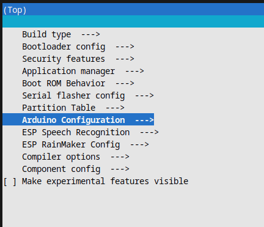
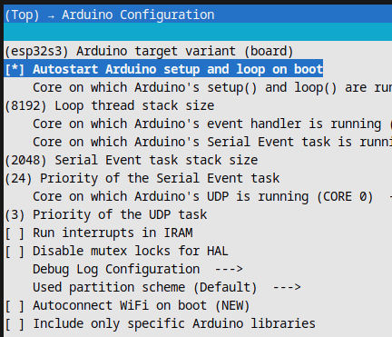

# ESP-IDF
## Introduction
In this tutorial, you will learn how to transition from the Arduino IDE environment to ESP-IDF.

To do this, you must first download and install [GNU/Linux or MacOS](https://github.com/espressif/vscode-esp-idf-extension/blob/master/README.md) (Windows, via [here](https://docs.espressif.com/projects/esp-idf/en/stable/esp32/get-started/windows-setup.html)).

> [!TIP]
> You can configure an alias to launch the ESP-IDF environment more easily: `alias idf=". $HOME/esp/esp-idf/export.sh"`.

Then install the VSCode or Eclipse plugin.

## Getting started with a Hello World
It is not necessary to delete your entire Arduino project. You need to adapt your code to the ESP-IDF environment.

To do this, you will need to add Arduino as a component.

Start by creating an application, either from ESP-IDF or from the terminal:
```
cd ~/esp
cp -r $IDF_PATH/examples/get-started/hello_world .
```

Next, let's start by defining the target for our project: `idf.py set-target esp32s3`. Then let's start looking at the configuration menu.

Now let's add our Arduino dependency as a component:
`idf.py add-dependency "espressif/arduino-esp32^3.0.2"`

> [!IMPORTANT]
> Check that you are using a version of ESP-IDF that is compatible with Arduino as an ESP-IDF component [here](https://docs.espressif.com/projects/arduino-esp32/en/latest/esp-idf_component.html).

We can now start working on the configuration menu: `idf.py menuconfig`.

If you get the error
```
CMake Error at managed_components/espressif__arduino-esp32/CMakeLists.txt:297 (message):
esp32-arduino requires CONFIG_FREERTOS_HZ=1000 (currently 100)
```

Go to the `sdkconfig` file, search for "CONFIG_FREERTOS_HZ" and set the value to 1000

To enable Arduino code style, go to `Arduino Configuration > [*] Autostart Arduino setup and loop on boot`.





If you want to add [PSRAM](https://docs.espressif.com/projects/esp-idf/en/latest/esp32/api-guides/external-ram.html#esp32-rev-v1) and Serial Monitor, go to `CMakeLists.txt` and add these lines

add_definitions(
-DARDUINO_USB_MODE
-DARDUINO_USB_CDC_ON_BOOT
-DBOARD_HAS_PSRAM
-mfix-esp32-psram-cache-issue
)

Now, go to your `main/main.cpp` code and before doing your habitual Arduino code, don't forget to add `#include "Arduino.h"`

## SDCam

What you need to understand is that by switching from ESP-IDF, you will have to define the board yourself. This involves defining pins in your code.


For example, for the SD card, you'll have to define the SPI pins yourself, following your manufacturer's documentation ([XIAO ESP32S3 Sense](https://wiki.seeedstudio.com/xiao_esp32s3_sense_filesystem/)):

```cpp

// ...

#define SD_CS_PIN    21
#define SPI_MOSI_PIN 9
#define SPI_MISO_PIN 8
#define SPI_SCK_PIN  7

// ...

void setup(){
    // ...

    SPI.begin(SPI_SCK_PIN, SPI_MISO_PIN, SPI_MOSI_PIN);

    // ...

    if(!SD.begin(SD_CS_PIN, SPI)){
      Serial.println("Card Mount Failed");
      return;
    }

    // ...
}
```