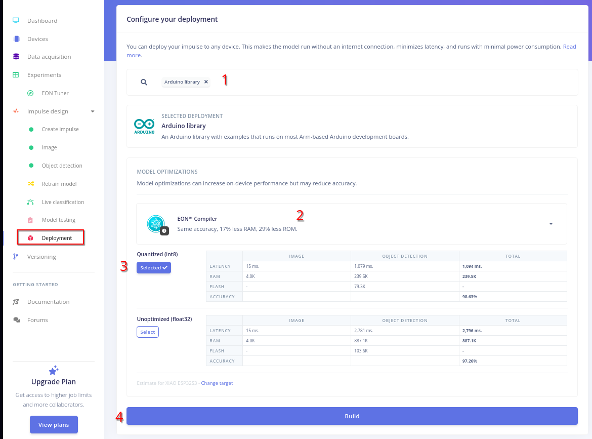

# Object Detection
## Choosing a labeling method
Set labelling method to 'Bounding boxes'

## Adding data
To add data, click on ‘Add existing data’.

Then click on "Upload data".

A menu will open, making it easier to upload a folder.

Next, if you have not planned to separate your training data from your testing data, then click on 'Automatically split between training and testing'. This will randomly split your data with an 80%/20% ratio.

> [!TIP]
> You can also have 'train' or 'training' and 'test' or 'testing' in the parent folder, allowing you to split your data when uploading.

> [!IMPORTANT]
> If you have planned to do the bounding boxes before uploading, please [read the documentation](https://docs.edgeimpulse.com/docs/tools/edge-impulse-cli/cli-uploader#bounding-boxes)

## Labelling data
If you have already labelled your items, you can skip this stage.

You can use the manual labelling tool and use the YOLO model (or track the object if you have taken successive images).

Or you can use the AI. For the AI prompt, follow this format: ‘Description (object class, confidence level)’.

## Creating your impulse

Each project is based around an impulse (at least).
An impulse is an experience, and you can find it under this term. It describes the path to a trained model. It is made up of 3 blocks:
1. Input block: This describes how your images are resized.
2. Processing block: This is a feature extractor and will also normalise the data so that it can be used in the training phase.
3. Learning block: The training phase...

Using more impulses (up to 3 with the free plan) will let you compare different results.

For our project, you want an image processing block and an Object Detection processing block.

## Processing block
It is a normalizer that will convert your image to RGB or greyscale format.

Once you choose your image color depth, you have to save the parameters. Next, click on 'Generate features'. After a moment, you'll get a graph. The farther points from the different classes are, the better it is. 

## Learning block (Training)

1. Choose the number of training cycles (aka 'Epoch')
2. Choose the learning rate
3. Check data augmentation if you have not transformed your dataset (with noise, for example)
4. Choose your model: FOMO, because MobileNetV2-based, a very efficient model for embedded devices. "0.35" corresponds to the wide factor. 0.35 means your neural network is $~3$ times smaller than the original one.

> [!IMPORTANT]
> We used the default values (60 for the number of training cycles, 0.001 for the learning rate). If you want to reduce the number of training cycles, do not forget to increase the learning rate.

## Building project
1. Search for Arduino Library.
2. Be sure to select EON Compiler.
3. Select Quantized (int8) to have a smaller and faster model.
4. Build

You can go back to the parent folder "Edge Impulse".