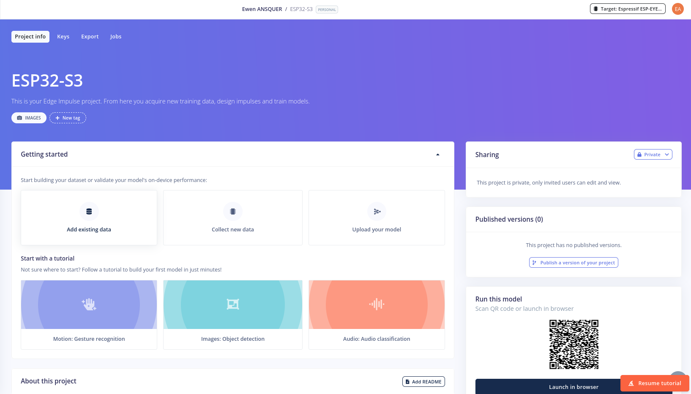

# Edge Impulse

## Introduction

In this section, you are going to learn how to use Edge Impulse to incorporate your generated model into the Arduino IDE for image processing.

Once the project has been created, you will get this dashboard:

First of all, we can start by defining the device that will run the driven model, by clicking on 'target':

The configuration we used for [XIAO ESP32S3 Sense](https://wiki.seeedstudio.com/xiao_esp32s3_getting_started/):

| Name              | Value        |
|-------------------|--------------|
| Processor Family  | Custom       |
| Clock rate        | 240 MHz      |
| Accelerator       | None         |
| Custom device name| XIAO ESP32S3 |
| RAM               | 8 Mb         |
| ROM               | 8 Mb         |
| Latency           | 100 ms       |

## Choosing the type of final model

To choose the final model, you need to know your requirements. For example, is the position of an object in the image to be considered important? If so, you should opt for object detection.

2 types of models are proposed in this tutorial:

1. [object detection](ObjectDetection/README.md) ;

2. [object classification (via Transfer Learning)](TransferLearning/README.md).

## Deploying the model

Once the model has been built, you need to import it onto Arduino.

To do this, go to ‘Sketch’ > ‘Import a library’ > ‘Add .ZIP library’.

There's one last thing to do: set the camera pins.

You can check whether the configuration of your model is defined in [here](https://github.com/espressif/arduino-esp32/blob/master/libraries/ESP32/examples/Camera/CameraWebServer/camera_pins.h)

If not, you can look at the technical documentation. Example for the [XIO ESP32S3 Sense](https://github.com/espressif/arduino-esp32/blob/master/libraries/ESP32/examples/Camera/CameraWebServer/camera_pins.h):

| ESP32-S3 GPIO | Camera Signal  | ESP32-S3 GPIO | Camera Signal  |
|---------------|----------------|---------------|----------------|
| GPIO10        | XMCLK          | GPIO11        | DVP_Y8         |
| GPIO12        | DVP_Y7         | GPIO13        | DVP_PCLK       |
| GPIO14        | DVP_Y6         | GPIO15        | DVP_Y2         |
| GPIO16        | DVP_Y5         | GPIO17        | DVP_Y3         |
| GPIO18        | DVP_Y4         | GPIO38        | DVP_VSYNC      |
| GPIO39        | CAM_SCL        | GPIO40        | CAM_SDA        |
| GPIO47        | DVP_HREF       | GPIO48        | DVP_Y9         |

You can also check our [sketch](xiao-esp32s3-sense_camera.ino).

Before uploading, please check that PSRAM is enabled ('Tools' > 'PSRAM')
Review suggestions
3
unlocked-suggestion-icon
…section, you are going to will learn how to…
uphook-message-icon
