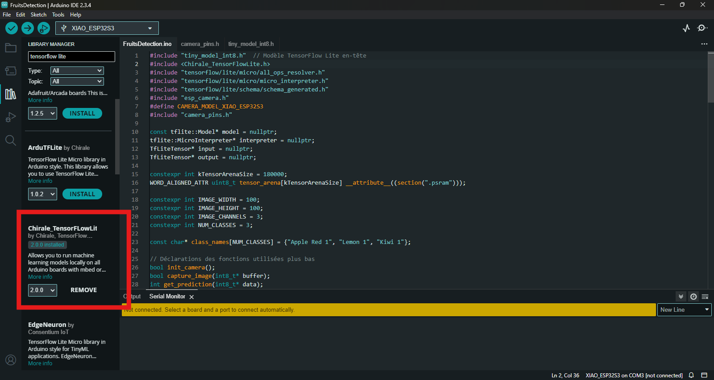
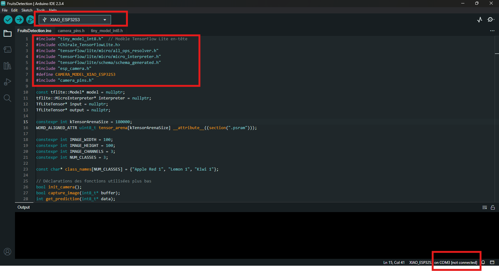
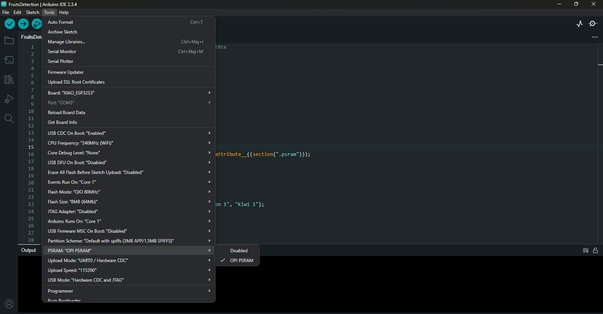

# Tiny Fruit Classifier for ESP32S3

Train a small CNN model to classify fruit using TensorFlow on Google collab.

---
Here is a simplified summary of the steps to follow to create your own model and how to import it into Arduino to deploy it on a XIAO ESP32S3 Sense microcontroller.

## TensorFlow

### 1. The dataset

Before you start, you need a dataset, If you have one available on your computer, you can import it directly into your Colab using the following command:  

```bash
from google.colab import files
uploaded = files.upload()
```
Or you can download one from a platform of your choice, for my example I downloaded from Kaggle, using this command:

You can keep and use the whole dataset or do as I did and choose only certain elements that interest you.  

---

it's important that your dataset looks like this:

```
selected_fruits.zip
├── Red Apple 1/
├─── Kiwi 1/
├─── Lemon 1/
└─── ...
```

  so that labelling can be done automatically according to the name of the folder where the image is located
  
---

### 2. Data Processing  
Now that we have images, we need to process them beforehand:

We define the desired size for the images, whether they are black and white or in color, the number of classes (corresponding to the number of different fruits we need to recognize — here, 3), the number of batches, and the number of epochs. These settings are essential so that TensorFlow can correctly create a dataset with images that are automatically resized, normalized, and labeled (following the directory structure).

### 3. Training and Evaluation  

Once processing is complete, we will split our data into 2 sets (or 3 depending on the need), keeping the largest portion for training. Typically, we use a ratio of 70% for training and 30% for evaluating the model.  
Optionally, we can also display the model's progress curve and some evaluation metrics to perform analysis. For the model to be effective, we aim for a success rate of at least 70–80%. To increase this number, we can either add more data, change the model, or make it more complex.

### 4. Model Quantization  
Since our model will be deployed on a microcontroller, it is crucial to convert it to TensorFlow Lite to ensure compatibility and that it can be executed. Once the conversion is done, we will quantize our model by converting it to 8-bit format to reduce its size as much as possible. This ensures our model is as compact as possible.  
We will download our TFLite model.

### 5. Convert TFLite Model to C Header (.h)  

To use our model on Arduino, we convert it into a C header file, which we will also download and place in the same directory as our Arduino sketch.
```
Arduino
├── FruitsDetection/
    ├─── FruitsDetection.ino/
    ├─── model_int8.h/
    └─── camera_pins.h/
```

---

# Final Outputs

| File | Description |
|:----|:------------|
| `tiny_model_int8.tflite` | Quantized TFLite model |
| `tiny_model_int8.h` | C header array for microcontrollers |

---

## Arduino

To use your TensorFlow Lite model on Arduino, you first need to download a library.  
* Go to **Tools** then **Manage Libraries...**  
* Type "TensorFlow Lite" in the search bar  
* Select the **"Chirale_TensorFlowLite"** library
  
Then import it in the header of your file.

### Points to Check  
* 1. Make sure you have correctly selected your board

     
* 2. Check your header files  
* 3. Select the correct port  
* 4. Make sure PSRAM is enabled
  
